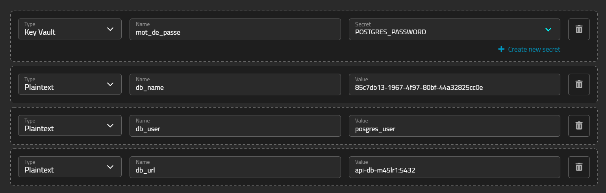

Mobou Tachago Murielle 32027026

Lancer docker:
docker build . pour builder un container en renomant l image docker

FROM openjdk:11 AS TEMP_BUILD_IMAGE
ENV APP_HOME=/app/
WORKDIR /app/
COPY build.gradle .
COPY settings.gradle .
COPY gradlew .
COPY gradle gradle
RUN ls -la
RUN gradlew build -x test

COPY . .
RUN ls -la
RUN ./gradlew build -x test

FROM openjdk:11
ENV ARTIFACT_NAME=covid-appli-0.0.1-SNAPSHOT.jar
ENV APP_HOME=/usr/app
WORKDIR $APP_HOME
COPY --from=TEMP_BUILD_IMAGE $APP_HOME/build/libs/$ARTIFACT_NAME .
EXPOSE 8080
CMD ["java","-jar","/usr/app/covid-appli-0.0.1-SNAPSHOT.jar"]

J'ai créé deux services sur mogenius Api qui est mon projet back contenant mes api et 
api_db qui est ma base de donnée

mot de passe bd: password
dans la bd

variables d'environnement api

